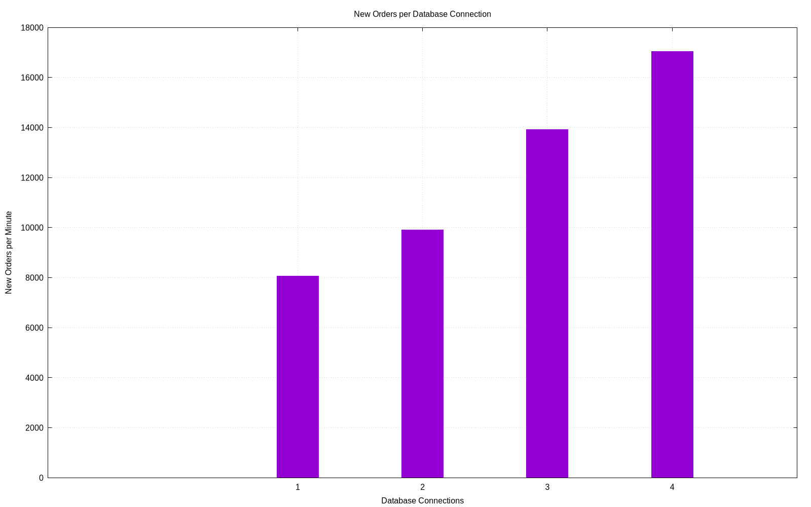

-------------------
Performance Testing
-------------------

There are many additional performance testing scenarios beyond using this
workload as defined by the TPC specification.  This sections describes some of
them.

Database Connection Scaling
===========================

This test is performed by the *test-connection-scaling* script.

The purpose of this test is to drive the system as hard as possible.  This is
accomplished by running the transaction mix as quickly as possibly with no
keying or thinking time.  The multi-process event-driven driver is used in this
configuration to also randomly emulate any terminal by setting the home
warehouse and district is randomly selected before each transaction.

This script is run a series of tests starting with 1 database connection up to
the number of detected processors of the driver system, adding 1 database
connection per step in the series.  The script is primarily intended to be run
in a 1-tier system configuration, but may be run in a 2-tier configuration and
may needs some additional intelligence or options for that.

Each step in the series will spend 1 minute to warm up and establish all
connections to the database, then run for an additional 5 minutes and stop
before starting the next test in the series.  The warm up time and test
duration can be varied.

At the end of the test, the script will create a bar plot of the reported
metric of each test vs. the number of database connections used.  The sar data
from all the tests will be aggregated and plotted.

Here are some examples plots from a system with 4 logical processors where it
spend 3 minutes warming up before running another 10 minutes.

   Connection Scaling Transaction Rates per Database Connection

.. figure:: test-connection-scaling/tn-transaction-rate.png
   :align: center
   :target: test-connection-scaling/tn-transaction-rate.png
   :width: 100%

   Connection Scaling Transaction Rates

   Connection Scaling Processor Utilization
